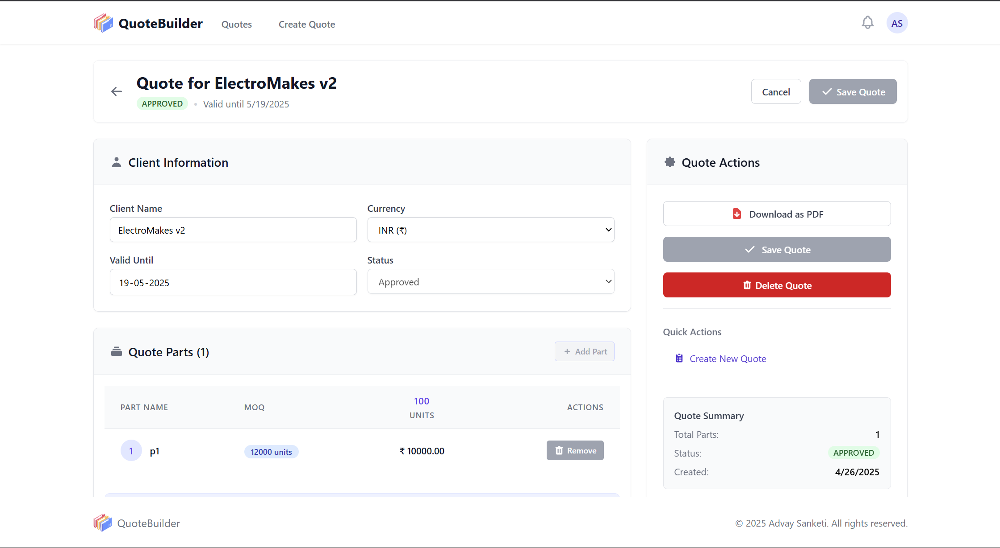
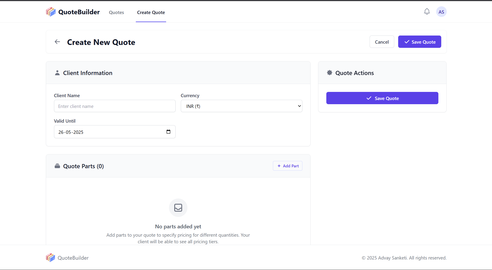

# QuoteBuilder

### Overview

**QuoteBuilder** is a dashboard for managing customer quotations. It features an intuitive UI for creating and managing quotes, dynamic pricing tables, and real-time currency conversion. Optimized for performance, responsiveness, and scalability.

🚀 **Live Link**: [Quote Builder](https://quote-builder-advay.vercel.app/)

---

## 🎨 Screenshots

| Page Name          | Screenshot                              |
| ------------------ | --------------------------------------- |
| **All Quotes**     |       |
| **Quote Detail**   |  |
| **Create Quote**  |  |

---

### 🔧 Tech Stack

- **Framework**: React (with TypeScript)
- **Styling**: TailwindCSS + Shadcn UI
- **State Management**: React Query
- **Form Handling**: React Hook Form + Zod
- **Routing**: React Router
- **API Calls**: Axios

---

### 🚀 Features

- 🔍 **Quotation Overview Page** – View all quotations with search and filter options.
- 📄 **Detailed Quotation Page** – Add/edit parts, MOQs, and prices per quantity.
- 💱 **Real-time Currency Conversion** – Instant price updates when switching between INR and USD.
- 📥 **PDF Download** – Generate and download stylized PDF quotes.
- 🧠 **AI-Powered RFQ Parsing** – Populate part data from RFQ screenshots (via backend).
- 🌙 **Dark/Light Mode**
- 🖥️ **Responsive UI** – Fully responsive across devices.

---

### ⚡ Optimizations

- ✅ **Virtual Scrolling** for large Quote lists.
- ✅ **Debounced Form Updates** to minimize unnecessary re-renders.
- ✅ **Component Code Splitting** for faster initial loads.
- ✅ **Memoized Selectors** for efficient state reads.
- ✅ **Optimistic UI Updates** for a snappy UX.

---

## 🚀 Installation & Setup

### 1️⃣ Clone the Repository

```sh
git clone https://github.com/AdvaySanketi/QuoteBuilder-Frontend.git
cd QuoteBuilder-Frontend
```

### 2️⃣ Install Dependencies

```sh
npm install
```

### 3️⃣ Set Up Environment Variables

Create a `.env.local` file in the root directory and add the following:

```sh
VITE_API_BASE_URL=your_base_url
VITE_JWT_SECRET=your_jwt_secret
```

Ensure the ```JWT_SECRET``` matches the one in the Backend

### 4️⃣ Run the Development Server

```sh
npm run dev
```

The project should now be running on **[http://localhost:3000](http://localhost:3000/)** 🚀

---

### 📁 Folder Structure

```
src/
│
├── components/     # UI Components
├── pages/          # Route-level components
├── models/         # TypeScript Interfaces/Types
├── services/       # API service layers
├── contexts/       # Context to maintain Quotes
└── utils/          # Helpers and constants
```

---

## 🤝 Contributing

Contributions are welcome! To contribute:

1. **Fork** this repository
2. **Create a new branch**:
   ```sh
   git checkout -b feature/AmazingFeature
   ```
3. **Commit your changes**:
   ```sh
   git commit -m 'Add some AmazingFeature'
   ```
4. **Push to the branch**:
   ```sh
   git push origin feature/AmazingFeature
   ```
5. **Open a Pull Request** 🚀

---

## 📝 License

Distributed under the MIT License. See [LICENSE](LICENSE) for more information.

---

## 🆘 Support

Having trouble? Want to request a feature? Here's how you can get help:

- Open an issue.
- Contact the maintainer: [Advay Sanketi](https://advay-sanketi-portfolio.vercel.app/)
